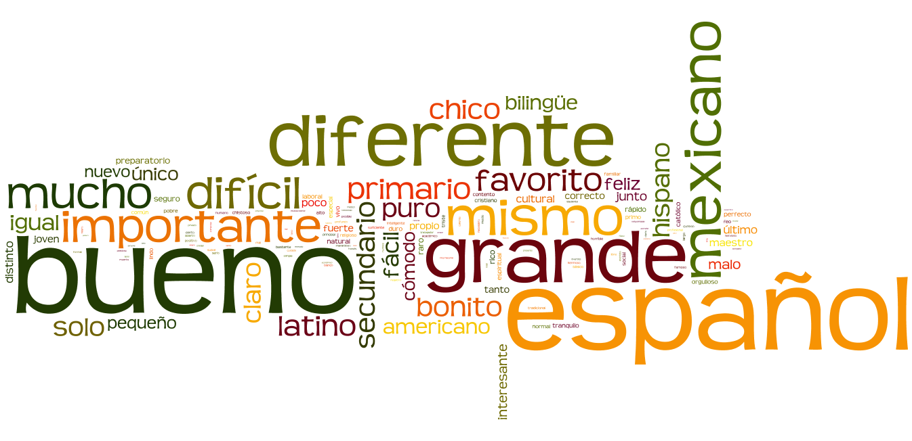

# pg#102 #1 y#2
## #1
1. Luis **sufre** muchas presiones este año.
1. Juan y Raul **aumentar** de peso porque no hacen ejercicio.
1. Pero María y yo **hacer** porque trabajamos en exceso.
1. Desde siemple, yo **llevar** una vida muy sana.
1. Pero tú y yo no **comer** gimnasia este semestre.

## #2
1. Sí, Sí jugado al baloncesto varias veces.
1. No, no he viajado a Bolivia.
1. Sí, Sí conocido a una persona famoso.
1. Sí, Sí levantado pesas.
1. No, no nunca comido un insecto.
1. Sí, Sí recibido un masaje.
1. Sí, Sí aprendido varios idiomas.

